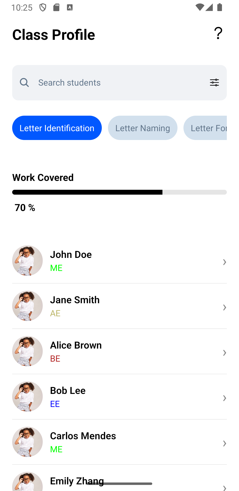
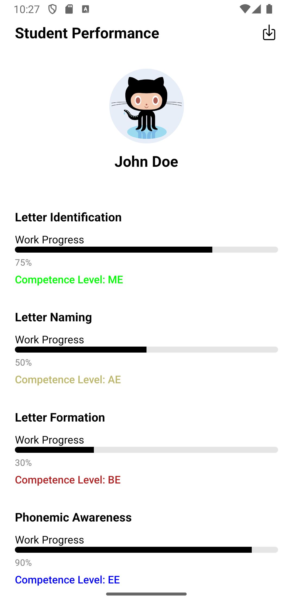

# Class Performance React Native App

## Screenshots

Below are some screenshots of the application in action:

| Class Profile Screen                          | Student Details Screen                          |
|-----------------------------------------------|-------------------------------------------------|
|  |  |

## Demo Video

[Demo Video](https://drive.google.com/file/d/1neLiXAhdwKnY6uIRZRYIfBEuLUd3HsTo/view?usp=sharing)

<video autoplay loop muted playsinline>
  <source src="screenshots/demo.mp4" type="video/mp4">
  Your browser does not support the video tag.
</video>

## Figma Design

You can view the app's design in Figma here: [Class Performance Figma](https://www.figma.com/design/QOk5GqNCDV6C2uMuwnLQ32/Class-performance?node-id=0-1&t=bwYRvoO86bimOW6m-1)


## Design Decisions
- **React Native Navigation**: The app uses React Navigation for seamless and native-like navigation between screens, providing a scalable structure for future screens and deep linking.
- **Redux Toolkit**: State management is handled with Redux Toolkit for predictable state updates and easy debugging, especially for class and student data.
- **Component Structure**: UI is broken into reusable components (e.g., `StudentCard`, `AppTab`) to promote maintainability and code reuse.
- **TypeScript**: Type safety is enforced throughout the app to catch errors early and improve developer experience.
- **Progress Bar**: The `react-native-progress` library is used for visualizing strand progress, offering a clean and customizable UI element.

## Assumptions Made
- The backend API endpoints for class and student data are available and follow the expected schema.
- All students have unique `studentId` values.
- The app is primarily targeted for mobile devices (Android) and tested on recent OS versions.
- The app will be run using Expo for easier development and testing.

## Setup and Testing
1. **Clone the Repository**
   ```sh
   git clone <repo-url>
   cd class-performance-react-native
   ```
2. **Install Dependencies**
   ```sh
   npm install
   # or
   yarn install
   ```
3. **Start the App**
   ```sh
   npx expo start
   ```
   - Use the Expo Go app on your device or an emulator to run the app.

## Technologies Used
- **React Native**: For building cross-platform mobile apps with a native feel.
- **Expo**: Simplifies development, testing, and deployment of React Native apps.
- **Redux Toolkit**: Efficient and scalable state management.
- **TypeScript**: Ensures type safety and reduces runtime errors.
- **React Navigation**: Handles navigation and routing between screens.
- **react-native-progress**: For progress bar UI elements.

## Why These Technologies?
- **React Native & Expo**: Rapid development, hot reloading, and easy deployment.
- **Redux Toolkit**: Simplifies state logic and reduces boilerplate.
- **TypeScript**: Improves code quality and maintainability.
- **React Navigation**: Most popular and well-supported navigation library for React Native.


---
For any issues or contributions, please open an issue or submit a pull request.
